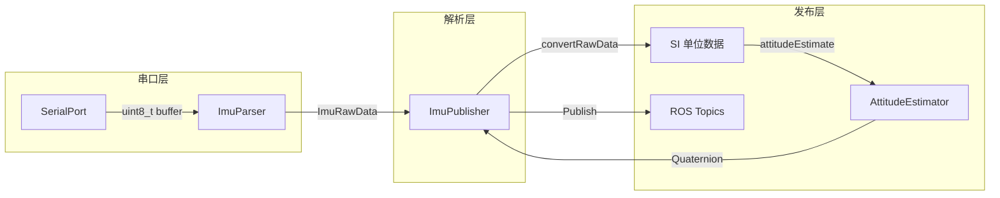
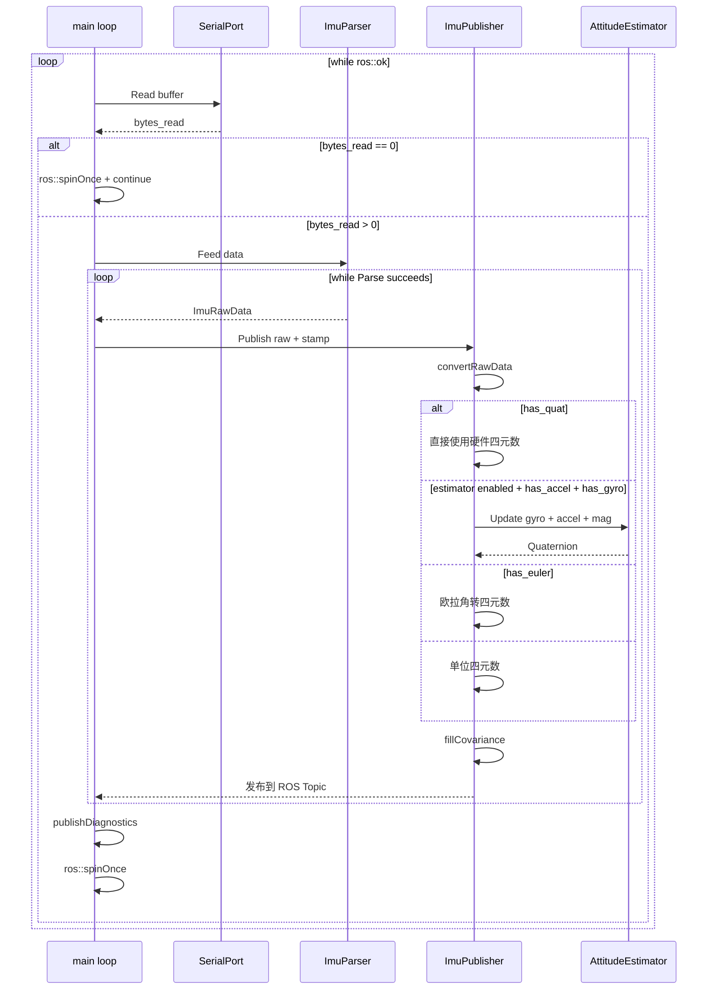
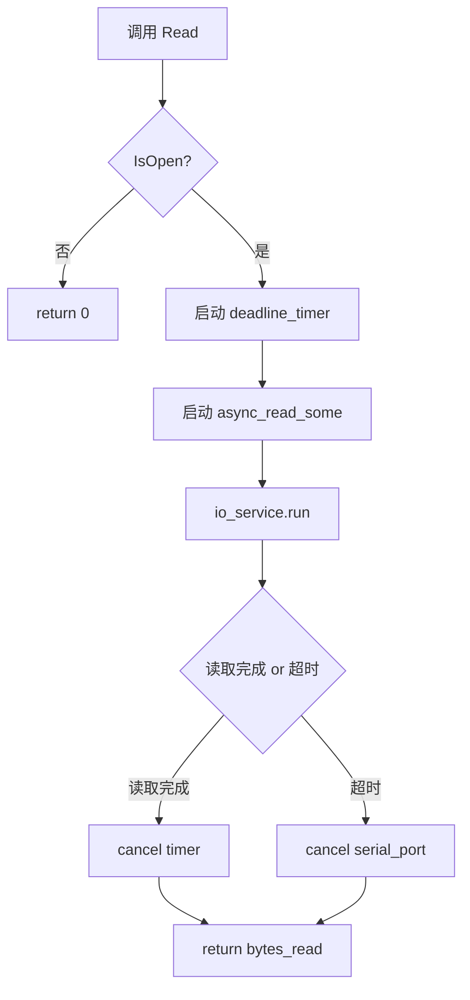
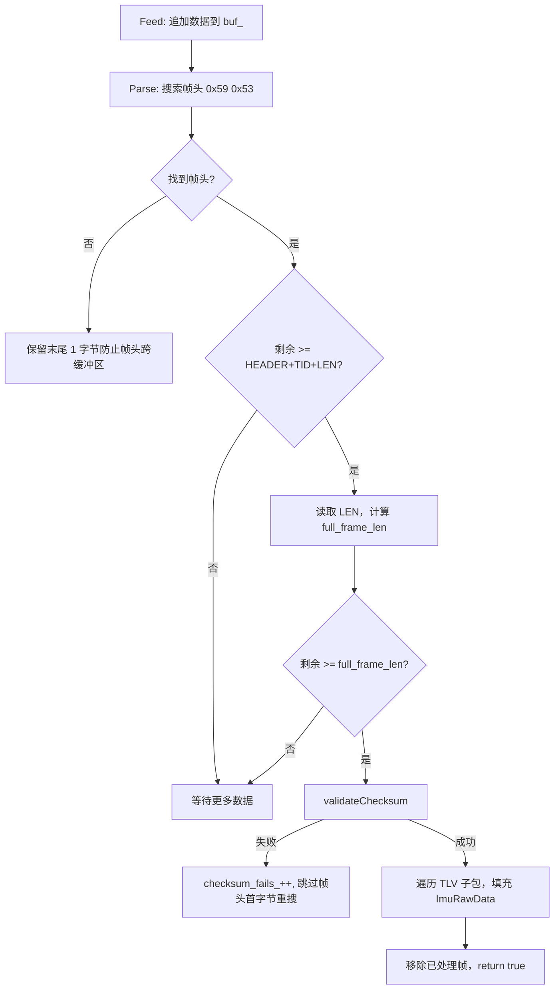
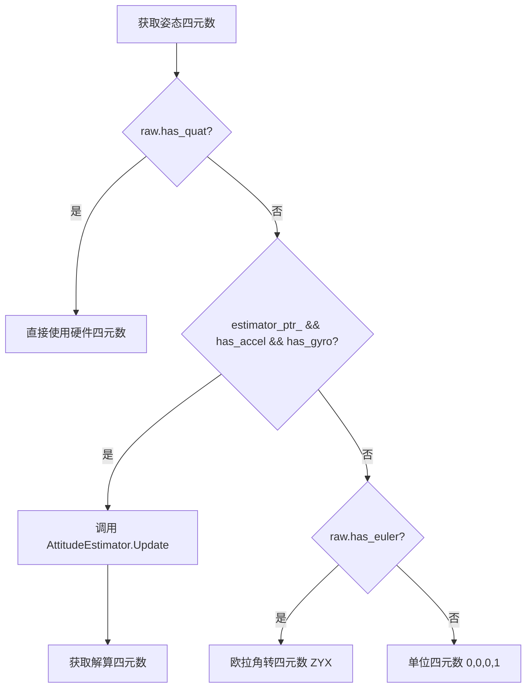
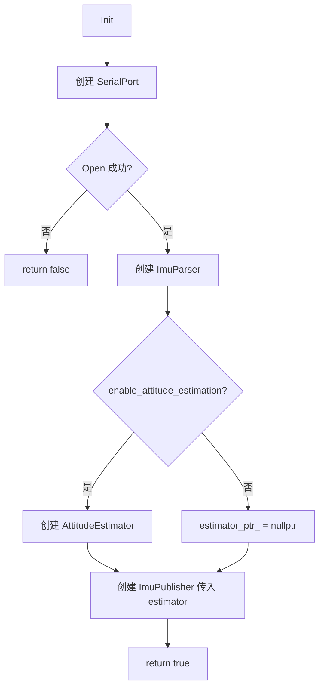
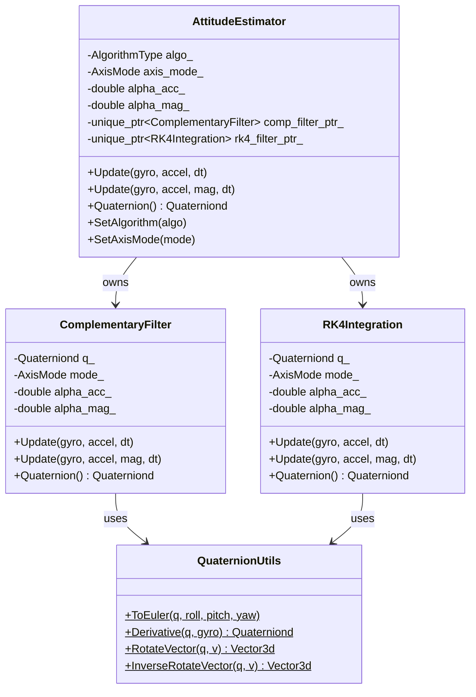
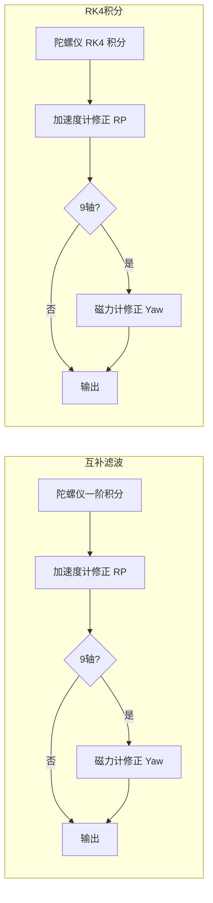

# IMU ROS Driver 架构设计文档

> 版本：0.0.1 | 更新日期：2026-06-04 | 维护者：guofeng

---

## 1. 项目概述

`imu_ros_driver` 是一个基于 ROS 1 (roscpp) 的 IMU 串口驱动节点，从串口读取二进制 IMU 数据，经过协议解析、单位转换和姿态解算后，发布为结构化的 ROS 消息。

### 1.1 核心能力

| 能力 | 说明 |
|------|------|
| 串口通信 | 基于 Boost.Asio 封装，支持可配置超时的同步读取 |
| 二进制协议解析 | 自动帧同步、双重累加校验和验证、TLV 子包解析 |
| 姿态解算 | 支持互补滤波和 RK4 两种算法，6 轴/9 轴两种模式 |
| 多通道发布 | 自定义 `ImuData` 消息 + 标准 `sensor_msgs/Imu` / `MagneticField` |
| 诊断统计 | 帧计数、校验失败计数，定期日志输出 |

### 1.2 技术栈

| 依赖 | 版本/说明 |
|------|-----------|
| ROS 1 | roscpp, std_msgs, sensor_msgs, geometry_msgs |
| Boost | system (asio, deadline_timer) |
| Eigen3 | 线性代数与四元数运算 |
| C++ 标准 | C++14 |
| 构建系统 | catkin + CMake 3.8+ |

---

## 2. 系统架构

### 2.1 顶层架构图

```mermaid
graph TD
    A[main] --> B[ImuDriverNode]
    B --> C[SerialPort]
    B --> D[ImuParser]
    B --> E[ImuPublisher]
    E --> F[AttitudeEstimator]
    F --> G[ComplementaryFilter]
    F --> H[RK4Integration]
    G --> I[QuaternionUtils]
    H --> I

    C -- 原始字节流 --> D
    D -- ImuRawData --> E
    E -- ROS 消息 --> P1[/a0110e/imu/data_serial]
    E -- ROS 消息 --> P2[/a0110e/imu/data_raw]
    E -- ROS 消息 --> P3[/a0110e/imu/mag]
```

### 2.2 数据流图



### 2.3 主循环时序图



---

## 3. 模块详细设计

### 3.1 SerialPort — 串口通信封装

| 项目 | 说明 |
|------|------|
| 头文件 | [`inc/serial_port.h`](inc/serial_port.h) |
| 源文件 | [`src/serial_port.cpp`](src/serial_port.cpp) |

**职责**：封装 Boost.Asio 串口操作，提供带超时的同步读取接口。

**类接口**：

```cpp
class SerialPort {
public:
    SerialPort(const std::string& port, int baud, int timeout_ms = 100);
    ~SerialPort();
    bool Open();       // 打开串口，配置 8N1 无流控
    void Close();      // 关闭串口
    bool IsOpen() const;
    size_t Read(uint8_t* buf, size_t max_len);  // 带超时同步读取
private:
    boost::asio::io_service io_;
    std::unique_ptr<boost::asio::serial_port> serial_ptr_;
    std::string port_;
    int baud_;
    int timeout_ms_;
};
```

**关键设计**：

- 使用 `async_read_some` + `deadline_timer` 实现超时读取，避免永久阻塞
- 超时回调调用 `serial_ptr_->cancel()` 中止读取操作
- `timeout_ms <= 0` 时强制使用 100ms 有效超时，保证节点稳定性
- 串口配置：8 数据位、无校验、1 停止位、无流控

**超时读取流程**：



---

### 3.2 ImuParser — 二进制协议解析器

| 项目 | 说明 |
|------|------|
| 头文件 | [`inc/imu_parser.h`](inc/imu_parser.h) |
| 源文件 | [`src/imu_parser.cpp`](src/imu_parser.cpp) |

**职责**：字节流缓冲、帧同步、校验和验证、TLV 子包提取。

**数据结构**：

```cpp
struct ImuRawData {
    int32_t ax, ay, az;       // 加速度 (1e-6 m/s^2)
    int32_t wx, wy, wz;       // 角速度 (1e-6 deg/s)
    int32_t hx, hy, hz;       // 磁场归一化 (1e-6, ID=0x30)
    int32_t mx, my, mz;       // 磁场强度 (0.001 mGauss, ID=0x31)
    int32_t q0, q1, q2, q3;   // 四元数 (1e-6, ID=0x41)
    int32_t pitch, roll, yaw;  // 欧拉角 (1e-6 deg, ID=0x40)
    int16_t temp;              // 温度 (0.01 °C, ID=0x01)
    bool has_accel, has_gyro, has_mag_norm, has_mag_strength;
    bool has_quat, has_euler, has_temp;
    bool valid;
};
```

**类接口**：

```cpp
class ImuParser {
public:
    ImuParser();
    void Feed(const uint8_t* data, size_t len);
    bool Parse(ImuRawData& out);
    size_t ChecksumFailCount() const;
    // 协议常量
    static constexpr uint8_t HEADER_BYTE0 = 0x59;
    static constexpr uint8_t HEADER_BYTE1 = 0x53;
    static constexpr size_t HEADER_SIZE = 2;
    static constexpr size_t READ_BUF_SIZE = 512;
};
```

**协议帧格式**：

```
| 字段     | 长度   | 说明                          |
|----------|--------|-------------------------------|
| Header   | 2 字节 | 0x59, 0x53                    |
| TID      | 2 字节 | 事务 ID                       |
| LEN      | 1 字节 | MESSAGE 字段长度              |
| MESSAGE  | LEN    | TLV 子包序列                  |
| CK       | 2 字节 | 双重累加校验和 (CK1, CK2)    |
```

**TLV 子包 ID 定义**：

| Data ID | 长度 | 内容 | 单位 |
|---------|------|------|------|
| 0x01 | 2 | 温度 | 0.01 °C |
| 0x10 | 12 | 加速度 X/Y/Z | 1e-6 m/s² |
| 0x20 | 12 | 角速度 X/Y/Z | 1e-6 deg/s |
| 0x30 | 12 | 磁场归一化 X/Y/Z | 1e-6 (无量纲) |
| 0x31 | 12 | 磁场强度 X/Y/Z | 0.001 mGauss |
| 0x40 | 12 | 欧拉角 Pitch/Roll/Yaw | 1e-6 deg |
| 0x41 | 16 | 四元数 q0/q1/q2/q3 | 1e-6 |

**校验和算法**（双重累加）：

```
CK1 = Σ(所有累加字节) 的低 8 位
CK2 = Σ(CK1 累加过程中的进位) 的低 8 位
累加范围：从 TID 开始到 MESSAGE 结束（包含 LEN 字节）
```

**解析流程**：



---

### 3.3 ImuPublisher — 消息构建与发布

| 项目 | 说明 |
|------|------|
| 头文件 | [`inc/imu_publisher.h`](inc/imu_publisher.h) |
| 源文件 | [`src/imu_publisher.cpp`](src/imu_publisher.cpp) |

**职责**：原始数据单位转换、姿态解算调用、ROS 消息构建与发布。

**类接口**：

```cpp
class ImuPublisher {
public:
    ImuPublisher(ros::NodeHandle& nh, bool publish_custom, bool publish_sensor_msgs,
                 const std::string& frame_id,
                 std::shared_ptr<imu_algorithm::AttitudeEstimator> estimator);
    void Publish(const ImuRawData& raw, const ros::Time& stamp);
private:
    static void fillCovariance(double cov[9], bool unknown = false);
    void convertRawData(const ImuRawData& raw, const ros::Time& stamp,
                        geometry_msgs::Vector3& accel, geometry_msgs::Vector3& gyro,
                        geometry_msgs::Vector3& mag, geometry_msgs::Quaternion& quat);
    void attitudeEstimate(const geometry_msgs::Vector3& accel,
                          const geometry_msgs::Vector3& gyro,
                          const geometry_msgs::Vector3& mag,
                          geometry_msgs::Quaternion& orientation,
                          const ros::Time& stamp);
};
```

**单位转换常量**：

| 原始数据 | 缩放因子 | 输出单位 |
|----------|----------|----------|
| 加速度 | `DATA × 1e-6` | m/s² |
| 角速度 | `DATA × 1e-6 × π/180` | rad/s |
| 磁场归一化 | `DATA × 1e-6` | 无量纲 |
| 磁场强度 | `DATA × 1e-3 × 1e-7` | Tesla |
| 四元数 | `DATA × 1e-6` | 无量纲 |
| 欧拉角 | `DATA × 1e-6 × π/180` | rad |

**姿态四元数优先级**：



**协方差矩阵策略**：

- 方向未知（无姿态解算器）：`covariance[0] = -1.0`，其余为 0
- 方向已知（有姿态解算器）：全部为 0（待标定）

---

### 3.4 ImuDriverNode — 顶层驱动节点

| 项目 | 说明 |
|------|------|
| 头文件 | [`inc/imu_driver_node.h`](inc/imu_driver_node.h) |
| 源文件 | [`src/imu_driver_node.cpp`](src/imu_driver_node.cpp) |

**职责**：参数读取、模块组合、主循环控制、诊断输出。

**类接口**：

```cpp
class ImuDriverNode {
public:
    ImuDriverNode(ros::NodeHandle& nh);
    bool Init();    // 初始化串口、解析器、姿态解算器、发布器
    void Run();     // 主循环：读取 → 解析 → 发布
    void Shutdown(); // 关闭串口，输出统计
private:
    void loadParams();
    void publishDiagnostics();  // 每 60 秒输出一次
};
```

**初始化流程**：



**参数列表**：

| 参数 | 类型 | 默认值 | 说明 |
|------|------|--------|------|
| `port` | string | `/dev/ttyUSB0` | 串口设备路径 |
| `baud` | int | `115200` | 波特率 |
| `timeout_ms` | int | `100` | 串口读取超时（毫秒） |
| `publish_custom` | bool | `true` | 是否发布自定义 ImuData |
| `publish_sensor_msgs` | bool | `false` | 是否发布标准 sensor_msgs |
| `frame_id` | string | `imu_link` | TF 坐标系 ID |
| `enable_attitude_estimation` | bool | `true` | 是否启用姿态解算 |
| `algorithm_type` | string | `complementary` | 算法类型 |
| `axis_mode` | string | `9` | 轴数模式 |
| `alpha_acc` | double | `0.02` | 加速度计融合系数 |
| `alpha_mag` | double | `0.01` | 磁力计融合系数 |

---

### 3.5 AttitudeEstimator — 姿态解算管理器

| 项目 | 说明 |
|------|------|
| 头文件 | [`inc/algorithm/attitude_estimator.h`](inc/algorithm/attitude_estimator.h) |
| 源文件 | [`src/algorithm/attitude_estimator.cpp`](src/algorithm/attitude_estimator.cpp) |
| 命名空间 | `imu_algorithm` |

**职责**：策略模式管理器，根据配置委托给互补滤波或 RK4 积分算法。

**类接口**：

```cpp
class AttitudeEstimator {
public:
    enum class AlgorithmType { COMPLEMENTARY, RK4 };
    enum class AxisMode { SIX_AXIS = 6, NINE_AXIS = 9 };

    AttitudeEstimator(AlgorithmType algo = AlgorithmType::COMPLEMENTARY,
                      AxisMode axis_mode = AxisMode::NINE_AXIS,
                      double alpha_acc = 0.02, double alpha_mag = 0.01);

    void Update(const Eigen::Vector3d& gyro, const Eigen::Vector3d& accel, double dt);
    void Update(const Eigen::Vector3d& gyro, const Eigen::Vector3d& accel,
                const Eigen::Vector3d& mag, double dt);
    const Eigen::Quaterniond& Quaternion() const;
    void EulerAngle(double& roll, double& pitch, double& yaw) const;
    void Reset();
    void SetAlgorithm(AlgorithmType algo);  // 切换算法（重置姿态）
    void SetAxisMode(AxisMode mode);        // 切换轴数（不重置）
    // ... 系数设置/获取方法
    static AlgorithmType AlgorithmFromString(const std::string& name);
    static AxisMode AxisModeFromString(const std::string& name);
};
```

**策略模式结构**：



---

### 3.6 ComplementaryFilter — 互补滤波算法

| 项目 | 说明 |
|------|------|
| 头文件 | [`inc/algorithm/complementary_filter.h`](inc/algorithm/complementary_filter.h) |
| 源文件 | [`src/algorithm/complementary_filter.cpp`](src/algorithm/complementary_filter.cpp) |
| 命名空间 | `imu_algorithm` |

**算法原理**：

1. **陀螺仪积分**：一阶近似 `q_new = q + dq/dt × dt`，归一化
2. **加速度计修正**：计算重力方向误差（测量 × 参考），以 `α_acc × 0.5` 比例修正四元数
3. **磁力计修正**（仅 9 轴）：将磁力计转到参考系水平面投影，再转回机体系计算误差，以 `α_mag × 0.5` 比例修正

**加速度计有效性检测**：

```
|accel.norm() - GRAVITY| / GRAVITY < accel_reject_threshold_ (默认 0.3)
```

超过阈值认为加速度计受到非重力干扰（如剧烈运动），跳过修正。

---

### 3.7 RK4Integration — 四阶龙格-库塔积分算法

| 项目 | 说明 |
|------|------|
| 头文件 | [`inc/algorithm/rk4_integration.h`](inc/algorithm/rk4_integration.h) |
| 源文件 | [`src/algorithm/rk4_integration.cpp`](src/algorithm/rk4_integration.cpp) |
| 命名空间 | `imu_algorithm` |

**算法原理**：

1. **RK4 四元数积分**：对四元数微分方程 `dq/dt = 0.5 × q ⊗ �` 进行四阶龙格-库塔积分
   - `k1 = f(t, q)`
   - `k2 = f(t + dt/2, q + k1×dt/2)`
   - `k3 = f(t + dt/2, q + k2×dt/2)`
   - `k4 = f(t + dt, q + k3×dt)`
   - `q(t+dt) = q(t) + (dt/6) × (k1 + 2k2 + 2k3 + k4)`
2. **加速度计/磁力计修正**：与互补滤波相同的修正策略

**与互补滤波的区别**：

| 特性 | 互补滤波 | RK4 |
|------|----------|-----|
| 积分精度 | O(dt²) 一阶欧拉 | O(dt⁵) 四阶 |
| 计算量 | 低 | 中（4 次四元数导数计算） |
| 适用场景 | 一般动态、嵌入式 | 高动态、低采样率 |
| 陀螺仪漂移修正 | 相同（加速度计+磁力计互补修正） | 相同 |

---

### 3.8 QuaternionUtils — 四元数工具类

| 项目 | 说明 |
|------|------|
| 头文件 | [`inc/algorithm/quaternion.h`](inc/algorithm/quaternion.h) |
| 命名空间 | `imu_algorithm` |

**工具方法**：

| 方法 | 说明 |
|------|------|
| `ToEuler(q, roll, pitch, yaw)` | 四元数 → 欧拉角（ZYX 旋转顺序），含万向锁处理 |
| `Derivative(q, gyro)` | 四元数导数 `dq/dt = 0.5 × q ⊗ ω`，手动展开 Hamilton 乘积 |
| `RotateVector(q, v)` | 正向旋转向量 `q × v × q⁻¹` |
| `InverseRotateVector(q, v)` | 逆向旋转向量 `q⁻¹ × v × q` |

**四元数约定**：

- Eigen 内部存储顺序：`(w, x, y, z)`
- `Eigen::Quaterniond::coeffs()` 返回顺序：`(x, y, z, w)` — 注意差异
- 旋转关系：`q` 表示从参考系到机体系的旋转

---

## 4. 文件结构

```
IMU_ROS_Driver/
├── CMakeLists.txt                          # catkin 构建配置
├── package.xml                             # ROS 包清单
├── README.md                               # 项目说明文档
├── .clang-format                           # 代码格式化配置（Google 风格）
├── msg/
│   └── ImuData.msg                         # 自定义 IMU 消息定义
├── launch/
│   └── imu_ros_publisher.launch            # Launch 启动文件
├── inc/                                    # 头文件目录
│   ├── serial_port.h                       # SerialPort 类声明
│   ├── imu_parser.h                        # ImuParser / ImuRawData 声明
│   ├── imu_publisher.h                     # ImuPublisher 类声明
│   ├── imu_driver_node.h                   # ImuDriverNode 类声明
│   └── algorithm/                          # 算法子目录
│       ├── quaternion.h                    # QuaternionUtils 工具类
│       ├── complementary_filter.h          # ComplementaryFilter 类声明
│       ├── rk4_integration.h               # RK4Integration 类声明
│       └── attitude_estimator.h            # AttitudeEstimator 类声明
├── src/                                    # 源文件目录
│   ├── imu_ros_publisher.cpp               # main 入口
│   ├── serial_port.cpp                     # SerialPort 实现
│   ├── imu_parser.cpp                      # ImuParser 实现
│   ├── imu_publisher.cpp                   # ImuPublisher 实现
│   ├── imu_driver_node.cpp                 # ImuDriverNode 实现
│   └── algorithm/                          # 算法实现
│       ├── complementary_filter.cpp
│       ├── rk4_integration.cpp
│       └── attitude_estimator.cpp
└── plans/                                  # 设计文档目录
    └── architecture_design.md              # 本文档
```

---

## 5. ROS 接口

### 5.1 话题

| 话题 | 消息类型 | 发布条件 | QoS 队列 |
|------|----------|----------|----------|
| `/a0110e/imu/data_serial` | `imu_ros_driver/ImuData` | `publish_custom=true` | 1 |
| `/a0110e/imu/data_raw` | `sensor_msgs/Imu` | `publish_sensor_msgs=true` | 10 |
| `/a0110e/imu/mag` | `sensor_msgs/MagneticField` | `publish_sensor_msgs=true` | 10 |

### 5.2 自定义消息 ImuData

```
std_msgs/Header header
geometry_msgs/Quaternion orientation
geometry_msgs/Vector3 linear_acceleration     # m/s^2
geometry_msgs/Vector3 angular_velocity        # rad/s
geometry_msgs/Vector3 magnetic_field          # Tesla
bool valid                                    # 校验是否通过
```

### 5.3 参数

全部通过私有节点句柄 `~` 读取，支持 launch 文件和命令行设置。

| 参数 | 类型 | 默认值 | 说明 |
|------|------|--------|------|
| `port` | string | `/dev/ttyUSB0` | 串口设备路径 |
| `baud` | int | `115200` | 波特率 |
| `timeout_ms` | int | `100` | 串口读取超时（毫秒） |
| `publish_custom` | bool | `true` | 发布自定义 ImuData |
| `publish_sensor_msgs` | bool | `false` | 发布标准 sensor_msgs |
| `frame_id` | string | `imu_link` | TF 坐标系 ID |
| `enable_attitude_estimation` | bool | `true` | 启用姿态解算 |
| `algorithm_type` | string | `complementary` | 算法：complementary / rk4 |
| `axis_mode` | string | `9` | 轴数：6 / 9 |
| `alpha_acc` | double | `0.02` | 加速度计融合系数 (0~1) |
| `alpha_mag` | double | `0.01` | 磁力计融合系数 (0~1) |

---

## 6. 串口协议详细规范

### 6.1 帧结构

```
字节偏移  字段      长度    说明
────────────────────────────────────────
0-1      Header    2      固定 0x59, 0x53
2-3      TID       2      事务 ID
4        LEN       1      MESSAGE 字段长度（字节）
5~5+LEN  MESSAGE   LEN    TLV 子包序列
5+LEN+1  CK1       1      校验和低字节
5+LEN+2  CK2       1      校验和高字节
```

### 6.2 TLV 子包格式

```
字节偏移  字段      长度    说明
────────────────────────────────────────
0        Data ID   1      数据标识
1        Pkt Len   1      载荷长度（字节）
2~2+Len  Payload   Len    载荷数据（小端字节序）
```

### 6.3 校验和算法

```
累加范围：TID + LEN + MESSAGE（从 pos+2 到 pos+4+LEN）
CK1 = Σ(byte[i]) & 0xFF
CK2 = Σ(CK1_running_sum) & 0xFF    // 即 CK1 累加过程中的进位累加
```

---

## 7. 姿态解算算法对比

### 7.1 互补滤波 vs RK4



### 7.2 6 轴 vs 9 轴

| 模式 | 传感器 | Roll/Pitch | Yaw | 适用场景 |
|------|--------|------------|-----|----------|
| 6 轴 | 加速度计 + 陀螺仪 | 无漂移 | 会漂移 | 无磁场环境、仅需水平姿态 |
| 9 轴 | 加速度计 + 陀螺仪 + 磁力计 | 无漂移 | 无漂移 | 全姿态需求、有稳定磁场 |

---

## 8. 构建与部署

### 8.1 构建

```bash
cd ~/catkin_ws
catkin_make
source devel/setup.bash
```

### 8.2 运行

```bash
# 使用 launch 启动（推荐）
roslaunch imu_ros_driver imu_ros_publisher.launch

# 使用 rosrun 启动
rosrun imu_ros_driver imu_ros_publisher _port:=/dev/ttyUSB0 _baud:=115200
```

### 8.3 代码格式化

```bash
find . \( -name "*.c" -o -name "*.cpp" -o -name "*.h" -o -name "*.hpp" \) \
    -exec clang-format -i {} \;
```

---

## 9. 故障排除

| 问题 | 可能原因 | 解决方法 |
|------|----------|----------|
| `Failed to open serial port` | 设备不存在或权限不足 | 检查设备路径，`sudo usermod -aG dialout $USER` |
| 无数据发布 | 波特率不匹配 | 确认 IMU 模块波特率与 `baud` 参数一致 |
| 大量 `Checksum mismatch` | 串口数据丢失或波特率错误 | 检查线缆，降低波特率重试 |
| 节点启动后卡住 | `timeout_ms=0` 且串口无数据 | 设置 `timeout_ms` 为非零值 |
| `ImuData` 话题无数据 | `publish_custom=false` | 设置 `publish_custom` 为 `true` |
| 姿态四元数始终为单位四元数 | 姿态解算未启用或缺少传感器数据 | 检查 `enable_attitude_estimation` 和传感器数据 |
| Yaw 角漂移 | 使用 6 轴模式 | 切换为 9 轴模式 `axis_mode:=9` |
| 加速度计修正失效 | 加速度模长偏离重力 | 检查 `alpha_acc` 和 `accel_reject_threshold` |

---

## 10. 许可证

MIT License
