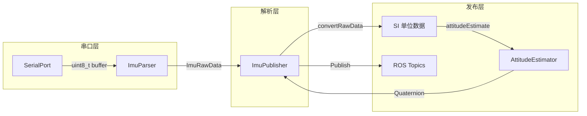
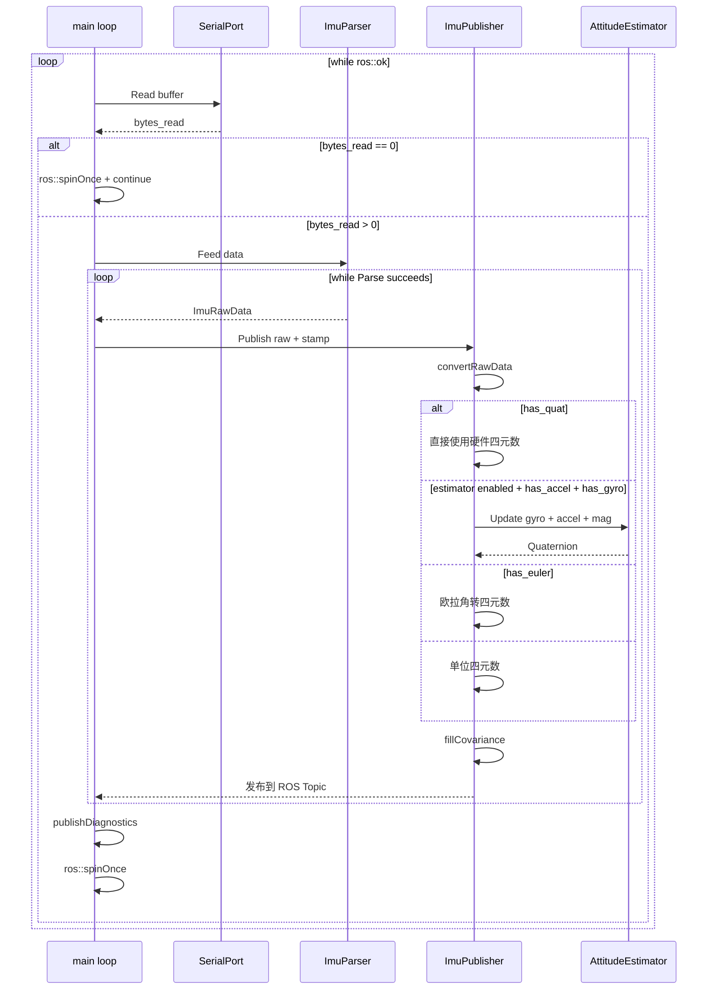
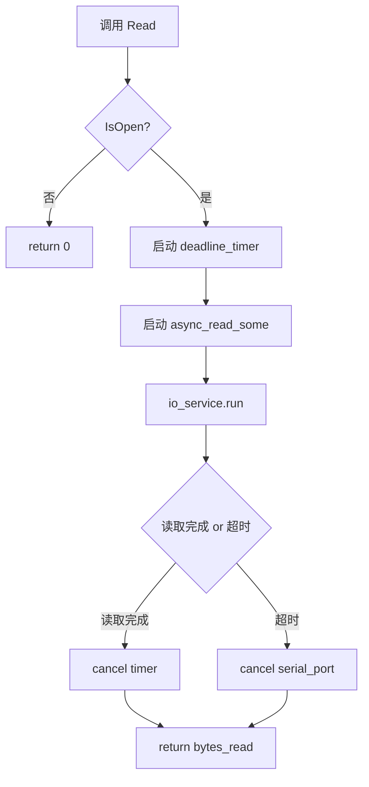
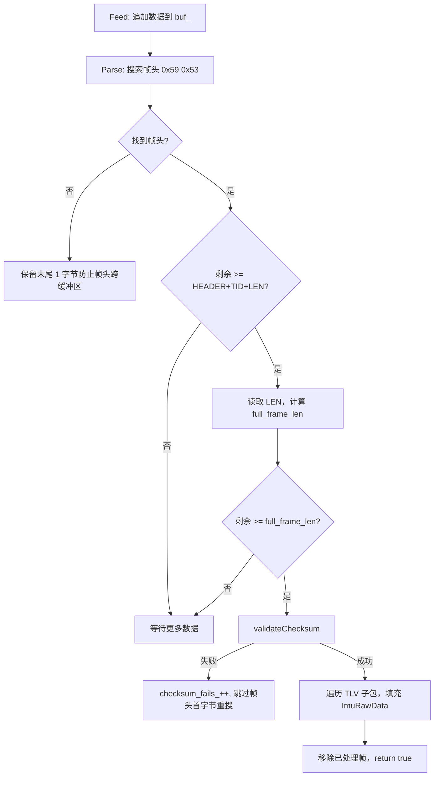
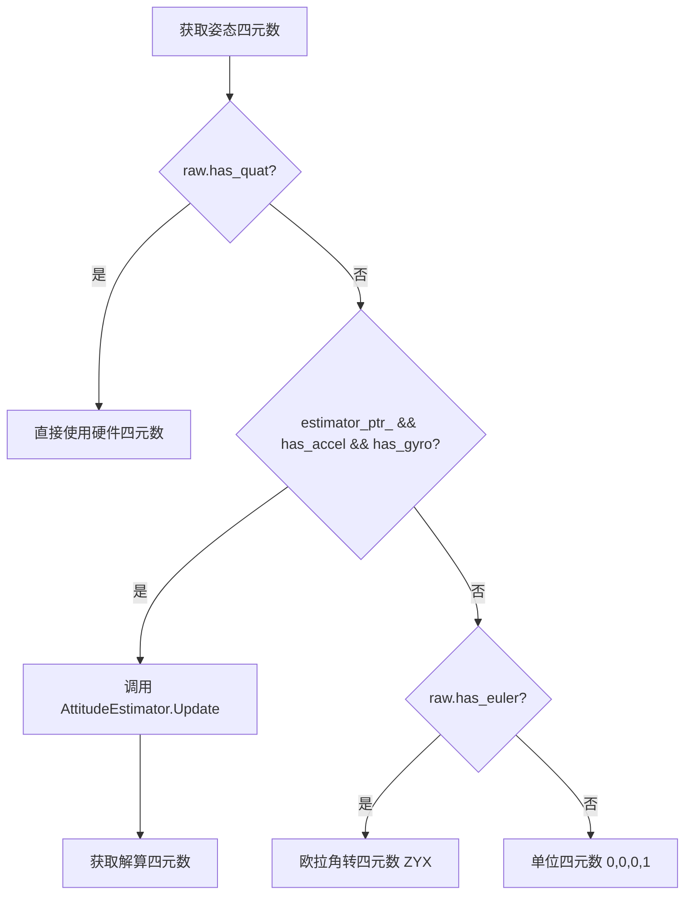
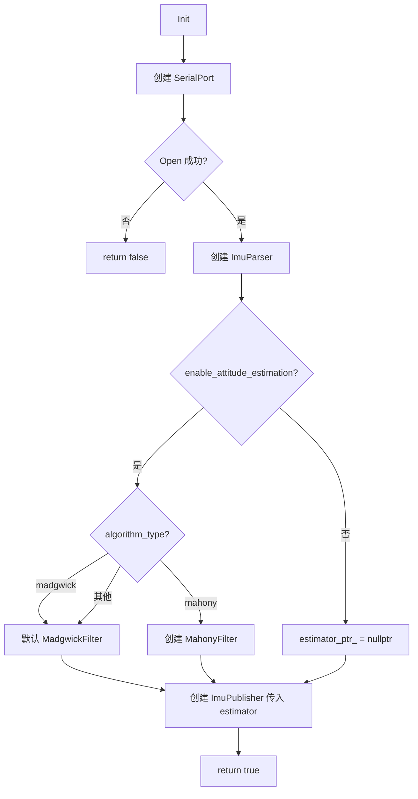
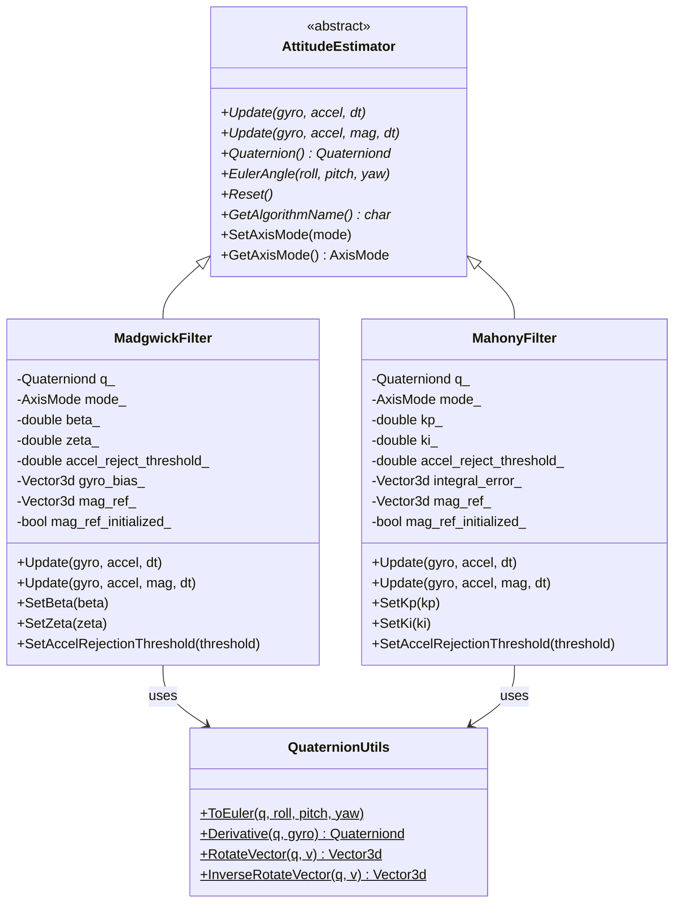
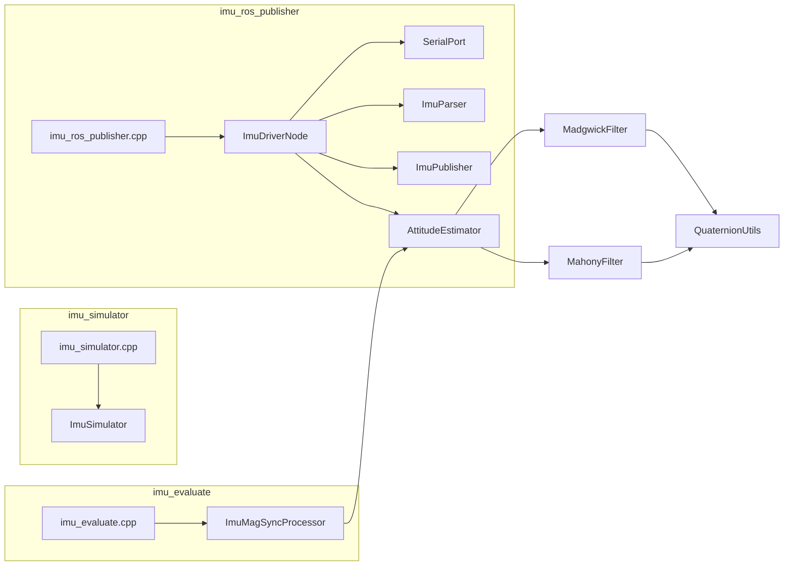
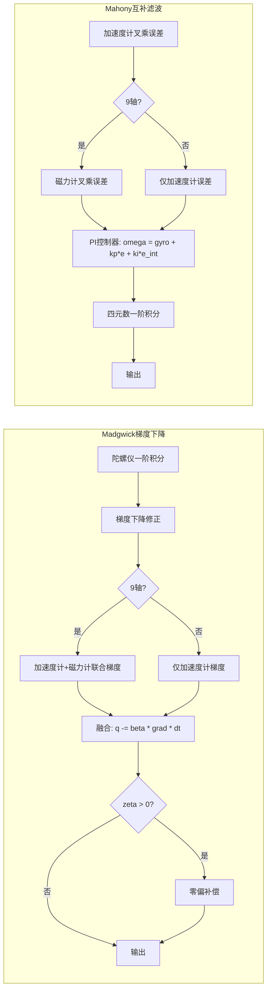

# IMU ROS Driver 架构设计文档

> 版本：0.0.1 | 更新日期：2026-06-09 | 维护者：guofeng

---

## 1. 项目概述

`imu_driver_ros` 是一个基于 ROS 1 (roscpp) 的 IMU 串口驱动节点，从串口读取二进制 IMU 数据，经过协议解析、单位转换和姿态解算后，发布为结构化的 ROS 消息。项目还包含仿真模拟器和滤波评估两个辅助工具节点。

### 1.1 核心能力

| 能力 | 说明 |
|------|------|
| 串口通信 | 基于 Boost.Asio 封装，支持可配置超时的同步读取 |
| 二进制协议解析 | 自动帧同步、双重累加校验和验证、TLV 子包解析 |
| 姿态解算 | 支持 Madgwick 梯度下降和 Mahony 互补滤波两种算法，6 轴/9 轴两种模式 |
| 多通道发布 | 自定义 `ImuData` 消息 + 标准 `sensor_msgs/Imu` / `MagneticField` |
| 仿真模拟 | 内置 IMU 仿真器，支持静态/正弦/旋转三种运动模式 |
| 滤波评估 | 同步订阅 Imu + Mag 数据，在线姿态解算并输出 CSV |
| 诊断统计 | 帧计数、校验失败计数，每 60 秒日志输出 |

### 1.2 技术栈

| 依赖 | 版本/说明 |
|------|-----------|
| ROS 1 | roscpp, std_msgs, sensor_msgs, geometry_msgs, visualization_msgs, message_filters |
| Boost | system (asio, deadline_timer) |
| Eigen3 | 线性代数与四元数运算 |
| C++ 标准 | C++17 |
| 构建系统 | catkin + CMake 3.8+ |

---

## 2. 系统架构

### 2.1 顶层架构图

```mermaid
graph TD
    A[main] --> B[ImuDriverNode]
    B --> C[SerialPort]
    B --> D[ImuParser]
    B --> E[ImuPublisher]
    E --> F[AttitudeEstimator]
    F --> G[MadgwickFilter]
    F --> H[MahonyFilter]
    G --> I[QuaternionUtils]
    H --> I

    C -- 原始字节流 --> D
    D -- ImuRawData --> E
    E -- ROS 消息 --> P1[/A0100E/imu/data_raw]
    E -- ROS 消息 --> P2[/A0100E/imu/data]
    E -- ROS 消息 --> P3[/A0100E/imu/mag]
```

### 2.2 数据流图



### 2.3 主循环时序图



---

## 3. 模块详细设计

### 3.1 SerialPort — 串口通信封装

| 项目 | 说明 |
|------|------|
| 头文件 | [`include/serial_port.h`](include/serial_port.h) |
| 源文件 | [`src/serial_port.cpp`](src/serial_port.cpp) |

**职责**：封装 Boost.Asio 串口操作，提供带超时的同步读取接口。

**类接口**：

```cpp
class SerialPort {
public:
    SerialPort(const std::string& port, int baud, int timeout_ms = 100);
    ~SerialPort();
    bool Open();                          // 打开串口，配置 8N1 无流控
    void Close();                         // 关闭串口
    bool IsOpen() const;
    size_t Read(uint8_t* buf, size_t max_len); // 带超时同步读取
private:
    boost::asio::io_service io_;
    std::unique_ptr<boost::asio::serial_port> serial_ptr_;
    std::string port_;
    int baud_;
    int timeout_ms_;
};
```

**关键设计**：

- 使用 `async_read_some` + `deadline_timer` 实现超时读取，避免永久阻塞
- 超时回调调用 `serial_ptr_->cancel()` 中止读取操作
- `timeout_ms <= 0` 时强制使用 100ms 有效超时，保证节点稳定性
- 串口配置：8 数据位、无校验、1 停止位、无流控

**超时读取流程**：



---

### 3.2 ImuParser — 二进制协议解析器

| 项目 | 说明 |
|------|------|
| 头文件 | [`include/imu_parser.h`](include/imu_parser.h) |
| 源文件 | [`src/imu_parser.cpp`](src/imu_parser.cpp) |

**职责**：字节流缓冲、帧同步、校验和验证、TLV 子包提取。

**数据结构**：

```cpp
struct ImuRawData {
    int32_t ax, ay, az;           // 加速度 (1e-6 m/s^2)
    int32_t wx, wy, wz;           // 角速度 (1e-6 deg/s)
    int32_t hx, hy, hz;           // 磁场归一化 (1e-6, ID=0x30)
    int32_t mx, my, mz;           // 磁场强度 (0.001 mGauss, ID=0x31)
    int32_t q0, q1, q2, q3;       // 四元数 (1e-6, ID=0x41)
    int32_t pitch, roll, yaw;     // 欧拉角 (1e-6 deg, ID=0x40)
    int16_t temp;                  // 温度 (0.01 °C, ID=0x01)
    bool has_accel, has_gyro, has_mag_norm, has_mag_strength;
    bool has_quat, has_euler, has_temp;
    bool valid;
};
```

**类接口**：

```cpp
class ImuParser {
public:
    ImuParser();
    void Feed(const uint8_t* data, size_t len);
    bool Parse(ImuRawData& out);
    size_t ChecksumFailCount() const;
    // 协议常量
    static constexpr uint8_t HEADER_BYTE0 = 0x59;
    static constexpr uint8_t HEADER_BYTE1 = 0x53;
    static constexpr size_t HEADER_SIZE = 2;
    static constexpr size_t READ_BUF_SIZE = 512;
};
```

**协议帧格式**：

```
| 字段    | 长度   | 说明                       |
|---------|--------|----------------------------|
| Header  | 2 字节 | 0x59, 0x53                 |
| TID     | 2 字节 | 事务 ID                    |
| LEN     | 1 字节 | MESSAGE 字段长度           |
| MESSAGE | LEN    | TLV 子包序列               |
| CK      | 2 字节 | 双重累加校验和 (CK1, CK2)  |
```

**TLV 子包 ID 定义**：

| Data ID | 长度 | 内容 | 单位 |
|---------|------|------|------|
| 0x01 | 2 | 温度 | 0.01 °C |
| 0x10 | 12 | 加速度 X/Y/Z | 1e-6 m/s² |
| 0x20 | 12 | 角速度 X/Y/Z | 1e-6 deg/s |
| 0x30 | 12 | 磁场归一化 X/Y/Z | 1e-6 (无量纲) |
| 0x31 | 12 | 磁场强度 X/Y/Z | 0.001 mGauss |
| 0x40 | 12 | 欧拉角 Pitch/Roll/Yaw | 1e-6 deg |
| 0x41 | 16 | 四元数 q0/q1/q2/q3 | 1e-6 |

**校验和算法**（双重累加）：

```
CK1 = Σ(所有累加字节) 的低 8 位
CK2 = Σ(CK1 累加过程中的进位) 的低 8 位
累加范围：从 TID 开始到 MESSAGE 结束（包含 LEN 字节）
```

**解析流程**：



---

### 3.3 ImuPublisher — 消息构建与发布

| 项目 | 说明 |
|------|------|
| 头文件 | [`include/imu_publisher.h`](include/imu_publisher.h) |
| 源文件 | [`src/imu_publisher.cpp`](src/imu_publisher.cpp) |

**职责**：原始数据单位转换、姿态解算调用、ROS 消息构建与发布。

**类接口**：

```cpp
class ImuPublisher {
public:
    ImuPublisher(ros::NodeHandle& nh, bool publish_custom, bool publish_sensor_msgs,
                 const std::string& frame_id,
                 std::shared_ptr<imu_algorithm::AttitudeEstimator> estimator);
    void Publish(const ImuRawData& raw, const ros::Time& stamp);
private:
    static void fillCovariance(double cov[9], bool unknown = false);
    void convertRawData(const ImuRawData& raw, const ros::Time& stamp,
                        geometry_msgs::Vector3& accel, geometry_msgs::Vector3& gyro,
                        geometry_msgs::Vector3& mag, geometry_msgs::Quaternion& quat);
    void attitudeEstimate(const geometry_msgs::Vector3& accel,
                          const geometry_msgs::Vector3& gyro,
                          const geometry_msgs::Vector3& mag,
                          geometry_msgs::Quaternion& orientation,
                          const ros::Time& stamp);
};
```

**单位转换常量**：

| 原始数据 | 缩放因子 | 输出单位 |
|----------|----------|----------|
| 加速度 | `DATA × 1e-6` | m/s² |
| 角速度 | `DATA × 1e-6 × π/180` | rad/s |
| 磁场归一化 | `DATA × 1e-6` | 无量纲 |
| 磁场强度 | `DATA × 1e-3 × 1e-7` | Tesla |
| 四元数 | `DATA × 1e-6` | 无量纲 |
| 欧拉角 | `DATA × 1e-6 × π/180` | rad |

**姿态四元数优先级**：



**协方差矩阵策略**：

- 方向未知（无姿态解算器）：`covariance[0] = -1.0`，其余为 0
- 方向已知（有姿态解算器）：全部为 0（待标定）

---

### 3.4 ImuDriverNode — 顶层驱动节点

| 项目 | 说明 |
|------|------|
| 头文件 | [`include/imu_driver_node.h`](include/imu_driver_node.h) |
| 源文件 | [`src/imu_driver_node.cpp`](src/imu_driver_node.cpp) |

**职责**：参数读取、模块组合、主循环控制、诊断输出。

**类接口**：

```cpp
class ImuDriverNode {
public:
    ImuDriverNode(ros::NodeHandle& nh);
    bool Init();     // 初始化串口、解析器、姿态解算器、发布器
    void Run();      // 主循环：读取 → 解析 → 发布
    void Shutdown(); // 关闭串口，输出统计
private:
    void loadParams();
    void publishDiagnostics(); // 每 60 秒输出一次
};
```

**初始化流程**：



**参数列表**：

| 参数 | 类型 | 默认值 | 说明 |
|------|------|--------|------|
| `port` | string | `/dev/ttyACM0` | 串口设备路径 |
| `baud` | int | `460800` | 波特率 |
| `timeout_ms` | int | `10` | 串口读取超时（毫秒） |
| `publish_custom` | bool | `true` | 是否发布自定义 ImuData |
| `publish_sensor_msgs` | bool | `false` | 是否发布标准 sensor_msgs |
| `frame_id` | string | `imu_link` | TF 坐标系 ID |
| `enable_attitude_estimation` | bool | `true` | 是否启用姿态解算 |
| `algorithm_type` | string | `madgwick` | 算法类型：`madgwick` / `mahony` |
| `axis_mode` | string | `9` | 轴数模式：`6` / `9` |
| `beta` | double | `0.5` | Madgwick 梯度下降步长 (rad/s) |
| `zeta` | double | `0.0` | Madgwick 陀螺仪零偏补偿系数 |
| `kp` | double | `5.0` | Mahony 比例增益 |
| `ki` | double | `0.05` | Mahony 积分增益 |

---

### 3.5 AttitudeEstimator — 姿态解算抽象基类

| 项目 | 说明 |
|------|------|
| 头文件 | [`include/algorithm/attitude_estimator.h`](include/algorithm/attitude_estimator.h) |
| 源文件 | [`src/algorithm/attitude_estimator.cpp`](src/algorithm/attitude_estimator.cpp) |
| 命名空间 | `imu_algorithm` |

**职责**：定义姿态解算器的统一抽象接口（多态基类），所有具体算法继承此基类实现。

**类接口**：

```cpp
class AttitudeEstimator {
public:
    enum class AxisMode { SIX_AXIS = 6, NINE_AXIS = 9 };

    explicit AttitudeEstimator(AxisMode mode = AxisMode::NINE_AXIS);
    virtual ~AttitudeEstimator() = default;

    // 更新接口（6/9 轴重载）— 纯虚函数
    virtual void Update(double gx, double gy, double gz,
                        double ax, double ay, double az, double dt) = 0;
    virtual void Update(double gx, double gy, double gz,
                        double ax, double ay, double az,
                        double mx, double my, double mz, double dt) = 0;
    virtual void Update(const Eigen::Vector3d& gyro,
                        const Eigen::Vector3d& accel, double dt) = 0;
    virtual void Update(const Eigen::Vector3d& gyro,
                        const Eigen::Vector3d& accel,
                        const Eigen::Vector3d& mag, double dt) = 0;

    // 状态查询
    virtual const Eigen::Quaterniond& Quaternion() const = 0;
    virtual void EulerAngle(double& roll, double& pitch, double& yaw) const = 0;
    virtual void Reset() = 0;

    // 轴模式切换
    virtual void SetAxisMode(AxisMode mode);
    AxisMode GetAxisMode() const;
    const char* GetAxisModeName() const;

    // 算法名称（由子类返回）
    virtual const char* GetAlgorithmName() const = 0;

    static AxisMode AxisModeFromString(const std::string& name);
};
```

**继承体系**：



---

### 3.6 MadgwickFilter — Madgwick 梯度下降姿态解算

| 项目 | 说明 |
|------|------|
| 头文件 | [`include/algorithm/madgwick_filter.h`](include/algorithm/madgwick_filter.h) |
| 源文件 | [`src/algorithm/madgwick_filter.cpp`](src/algorithm/madgwick_filter.cpp) |
| 命名空间 | `imu_algorithm` |

**算法原理**：

1. **陀螺仪积分**：一阶近似 `q_new = q + dq/dt × dt`，归一化
2. **梯度下降修正**：
   - 6 轴模式：计算重力方向的目标函数 `f(q, a)` 及其雅可比 `J`，梯度 `∇f = Jᵀ·f`，沿负梯度方向修正四元数
   - 9 轴模式：联合加速度计和磁力计构建 6 维目标函数，计算梯度并修正
3. **融合**：`q = q + dq_gyro × dt - β × ∇f × dt`
4. **陀螺仪零偏补偿**（可选）：当 `zeta > 0` 时，根据梯度下降方向估算角速率误差，更新零偏 `bias += ζ × ω_error × dt`，限幅 ±0.05 rad/s

**磁力计参考方向初始化**：

- 首次收到有效磁力计数据时，将测量转到惯性系水平面
- 水平分量 `bx = √(mx² + my²)`，垂直分量 `bz = mz`
- 参考方向 `mag_ref_ = [bx, 0, bz].normalized()`
- 后续帧中，磁力计修正以 `mag_ref_` 为基准计算误差

**加速度计有效性检测**：

```
|accel.norm() - GRAVITY| / GRAVITY < accel_reject_threshold_ (默认 0.3)
```

超过阈值认为加速度计受到非重力干扰（如剧烈运动），跳过修正。

**关键参数**：

| 参数 | 类型 | 默认值 | 说明 |
|------|------|--------|------|
| `beta` | double | 0.5 | 梯度下降步长/融合系数 (rad/s)，越大加速度计权重越高 |
| `zeta` | double | 0.0 | 陀螺仪零偏补偿系数，0 表示不补偿 |
| `accel_reject_threshold` | double | 0.3 | 加速度计有效性阈值（相对偏差） |

---

### 3.7 MahonyFilter — Mahony 互补式姿态估计

| 项目 | 说明 |
|------|------|
| 头文件 | [`include/algorithm/mahony_filter.h`](include/algorithm/mahony_filter.h) |
| 源文件 | [`src/algorithm/mahony_filter.cpp`](src/algorithm/mahony_filter.cpp) |
| 命名空间 | `imu_algorithm` |

**算法原理**：

1. **加速度计误差计算**：将惯性系重力方向 `[0,0,1]` 旋转到机体系得到估计重力 `g_est = q × [0,0,1]`，与归一化加速度计测量做叉乘 `e = g_est × a`
2. **磁力计误差计算**（仅 9 轴）：
   - 初始化磁场参考方向 `mag_ref_`（与 Madgwick 相同策略）
   - 将参考方向转回机体系 `m_ref_body = q × mag_ref_`
   - 与归一化磁力计测量做叉乘 `e_mag = m_ref_body × m`
   - 仅取 X/Y 分量（水平面修正航向）
3. **PI 控制器修正**：
   - 积分误差累积 `e_int += ki × e × dt`，限幅 ±1.0 rad/s
   - 修正角速度 `ω = gyro + kp × e + ki × e_int`
4. **四元数一阶积分**：`q = q ⊗ [1, 0.5·ω·dt]`，归一化

**关键参数**：

| 参数 | 类型 | 默认值 | 说明 |
|------|------|--------|------|
| `kp` | double | 5.0 | 比例增益，越大跟踪越快但噪声越大 |
| `ki` | double | 0.05 | 积分增益，消除稳态零偏漂移 |
| `accel_reject_threshold` | double | 0.2 | 加速度计有效性阈值（相对偏差） |

---

### 3.8 QuaternionUtils — 四元数工具类

| 项目 | 说明 |
|------|------|
| 头文件 | [`include/algorithm/quaternion.h`](include/algorithm/quaternion.h) |
| 命名空间 | `imu_algorithm` |

**工具方法**：

| 方法 | 说明 |
|------|------|
| `ToEuler(q, roll, pitch, yaw)` | 四元数 → 欧拉角（ZYX 旋转顺序），含万向锁处理 |
| `Derivative(q, gyro)` | 四元数导数 `dq/dt = 0.5 × q ⊗ ω`，手动展开 Hamilton 乘积 |
| `RotateVector(q, v)` | 正向旋转向量 `q × v × q⁻¹` |
| `InverseRotateVector(q, v)` | 逆向旋转向量 `q⁻¹ × v × q` |

**四元数约定**：

- Eigen 内部存储顺序：`(w, x, y, z)`
- `Eigen::Quaterniond::coeffs()` 返回顺序：`(x, y, z, w)` — 注意差异
- 旋转关系：`q` 表示从参考系到机体系的旋转

---

### 3.9 ImuSimulator — IMU 仿真模拟器

| 项目 | 说明 |
|------|------|
| 源文件 | [`src/imu_simulator.cpp`](src/imu_simulator.cpp) |

**职责**：生成模拟 IMU 数据并发布标准 ROS 话题，用于在 RViz 中可视化 IMU 姿态模型。无需串口硬件即可测试算法和可视化。

**类接口**：

```cpp
class ImuSimulator {
public:
    ImuSimulator(ros::NodeHandle& nh, ros::NodeHandle& pnh);
    void run();
private:
    void loadParams();
    void initPublishers();
    void initRNG();
    void computeMotion(double t, Eigen::Quaterniond& orientation,
                       Eigen::Vector3d& angular_velocity);
    Eigen::Vector3d computeAccel(const Eigen::Quaterniond& q);
    Eigen::Vector3d computeMag(const Eigen::Quaterniond& q);
    void timerCallback(const ros::TimerEvent& event);
};
```

**运动模式**：

| 模式 | 说明 |
|------|------|
| `static` | 水平静止，三轴欧拉角均为 0 |
| `sin` | 三轴正弦摇摆（默认），频率和幅度可配置 |
| `rotate` | 绕 Z 轴匀速旋转 |

**发布话题**：

| 话题 | 消息类型 | 说明 |
|------|----------|------|
| `/imu/data` | `sensor_msgs/Imu` | 含四元数姿态、角速度、线性加速度 |
| `/imu/mag` | `sensor_msgs/MagneticField` | 磁场矢量 |
| `visualization_marker` | `visualization_msgs/Marker` | RViz 方块可视化 |

**参数**：

| 参数 | 类型 | 默认值 | 说明 |
|------|------|--------|------|
| `publish_rate` | double | 50.0 | 发布频率 Hz |
| `frame_id` | string | `imu_link` | 坐标系 ID |
| `motion_type` | string | `sin` | 运动模式：static / sin / rotate |
| `gravity` | double | 9.80665 | 重力加速度 m/s² |
| `noise_accel` | double | 0.01 | 加速度计噪声标准差 m/s² |
| `noise_gyro` | double | 0.001 | 陀螺仪噪声标准差 rad/s |
| `noise_mag` | double | 0.0001 | 磁力计噪声标准差 T |
| `sin_freq` | double | 0.5 | 正弦运动频率 Hz |
| `sin_amplitude` | double | 0.3 | 正弦运动幅度 rad |
| `rotate_speed` | double | 0.5 | 旋转速度 rad/s |

**噪声模型**：高斯白噪声（`std::normal_distribution`），当前版本噪声添加已注释（预留接口）。

---

### 3.10 ImuMagSyncProcessor — 滤波评估工具

| 项目 | 说明 |
|------|------|
| 源文件 | [`src/imu_evaluate.cpp`](src/imu_evaluate.cpp) |

**职责**：同步订阅 `/imu/data` 和 `/imu/mag` 话题，在线运行姿态解算，将原始姿态与滤波后姿态对比输出到 CSV 文件，用于算法参数调优和性能评估。

**类接口**：

```cpp
class ImuMagSyncProcessor {
public:
    ImuMagSyncProcessor();
    void callback(const sensor_msgs::Imu::ConstPtr& imu_msg,
                  const sensor_msgs::MagneticField::ConstPtr& mag_msg);
private:
    message_filters::Subscriber<sensor_msgs::Imu> imu_sub_;
    message_filters::Subscriber<sensor_msgs::MagneticField> mag_sub_;
    message_filters::Synchronizer<ApproximateTime<Imu, MagneticField>> sync_;
    std::ofstream csv_file_;
    std::shared_ptr<imu_algorithm::AttitudeEstimator> attitude_estimator_ptr_;
};
```

**同步策略**：使用 `message_filters::ApproximateTime` 策略，允许 IMU 与磁力计消息微小时间差。

**CSV 输出格式**：

```
timestamp, ax, ay, az, gx, gy, gz, mx, my, mz,
roll_raw, pitch_raw, yaw_raw,
roll_filter, pitch_filter, yaw_filter
```

**参数**：

| 参数 | 类型 | 默认值 | 说明 |
|------|------|--------|------|
| `algorithm_type` | string | `madgwick` | 算法类型 |
| `axis_mode` | string | `6` | 轴数模式 |
| `beta` | double | 0.35 | Madgwick 梯度下降步长 |
| `zeta` | double | 0.01 | Madgwick 零偏补偿系数 |
| `kp` | double | 5.0 | Mahony 比例增益 |
| `ki` | double | 0.05 | Mahony 积分增益 |
| `csv_file` | string | `/home/guofeng/imu_data/imu_filter_output.csv` | CSV 输出路径 |

---

## 4. 文件结构

```
imu_driver_ros/
├── CMakeLists.txt                         # catkin 构建配置
├── package.xml                            # ROS 包清单
├── README.md                              # 项目说明文档
├── .clang-format                          # 代码格式化配置（Google 风格）
├── msg/
│   └── ImuData.msg                        # 自定义 IMU 消息定义
├── launch/
│   └── imu_ros_publisher.launch           # Launch 启动文件
├── rviz/                                  # RViz 配置目录
├── include/                               # 头文件目录
│   ├── serial_port.h                      # SerialPort 类声明
│   ├── imu_parser.h                       # ImuParser / ImuRawData 声明
│   ├── imu_publisher.h                    # ImuPublisher 类声明
│   ├── imu_driver_node.h                  # ImuDriverNode 类声明
│   └── algorithm/                         # 算法子目录
│       ├── quaternion.h                   # QuaternionUtils 工具类
│       ├── attitude_estimator.h           # AttitudeEstimator 抽象基类
│       ├── madgwick_filter.h              # MadgwickFilter 类声明
│       └── mahony_filter.h                # MahonyFilter 类声明
├── src/                                   # 源文件目录
│   ├── imu_ros_publisher.cpp              # 主驱动节点入口 (main)
│   ├── serial_port.cpp                    # SerialPort 实现
│   ├── imu_parser.cpp                     # ImuParser 实现
│   ├── imu_publisher.cpp                  # ImuPublisher 实现
│   ├── imu_driver_node.cpp                # ImuDriverNode 实现
│   ├── imu_simulator.cpp                  # 仿真模拟器节点 (main + ImuSimulator)
│   ├── imu_evaluate.cpp                   # 滤波评估节点 (main + ImuMagSyncProcessor)
│   └── algorithm/                         # 算法实现
│       ├── attitude_estimator.cpp         # AttitudeEstimator 基类实现
│       ├── madgwick_filter.cpp            # MadgwickFilter 实现
│       └── mahony_filter.cpp              # MahonyFilter 实现
└── plans/                                 # 设计文档目录
    └── architecture_design.md             # 本文档
```

---

## 5. 可执行文件与构建目标

### 5.1 构建目标

| 可执行文件 | 入口源文件 | 链接的源文件 | 说明 |
|-----------|-----------|-------------|------|
| `imu_ros_publisher` | [`src/imu_ros_publisher.cpp`](src/imu_ros_publisher.cpp) | `serial_port.cpp`, `imu_parser.cpp`, `imu_publisher.cpp`, `imu_driver_node.cpp`, 算法库 | 串口驱动主节点 |
| `imu_simulator` | [`src/imu_simulator.cpp`](src/imu_simulator.cpp) | 算法库 | 仿真模拟器 |
| `imu_evaluate` | [`src/imu_evaluate.cpp`](src/imu_evaluate.cpp) | 算法库 | 滤波评估工具 |

**算法库源文件**（`ALGORITHM_SOURCES`）：

- [`src/algorithm/madgwick_filter.cpp`](src/algorithm/madgwick_filter.cpp)
- [`src/algorithm/mahony_filter.cpp`](src/algorithm/mahony_filter.cpp)
- [`src/algorithm/attitude_estimator.cpp`](src/algorithm/attitude_estimator.cpp)

### 5.2 依赖关系



---

## 6. ROS 接口

### 6.1 话题

**imu_ros_publisher 发布的话题**：

| 话题 | 消息类型 | 发布条件 | QoS 队列 |
|------|----------|----------|----------|
| `/A0100E/imu/data_raw` | `imu_driver_ros/ImuData` | `publish_custom=true` | 1 |
| `/A0100E/imu/data` | `sensor_msgs/Imu` | `publish_sensor_msgs=true` | 10 |
| `/A0100E/imu/mag` | `sensor_msgs/MagneticField` | `publish_sensor_msgs=true` | 10 |

**imu_simulator 发布的话题**：

| 话题 | 消息类型 | 说明 |
|------|----------|------|
| `/imu/data` | `sensor_msgs/Imu` | 仿真 IMU 数据 |
| `/imu/mag` | `sensor_msgs/MagneticField` | 仿真磁场数据 |
| `visualization_marker` | `visualization_msgs/Marker` | RViz 可视化标记 |

**imu_evaluate 订阅的话题**：

| 话题 | 消息类型 | 说明 |
|------|----------|------|
| `/imu/data` | `sensor_msgs/Imu` | 同步订阅 IMU 数据 |
| `/imu/mag` | `sensor_msgs/MagneticField` | 同步订阅磁场数据 |

### 6.2 自定义消息 ImuData

```
std_msgs/Header header
geometry_msgs/Quaternion orientation      # 姿态四元数
geometry_msgs/Vector3 linear_acceleration # m/s^2
geometry_msgs/Vector3 angular_velocity    # rad/s
geometry_msgs/Vector3 magnetic_field      # Tesla
bool valid                                # 校验是否通过
```

### 6.3 参数

全部通过私有节点句柄 `~` 读取，支持 launch 文件和命令行设置。

**串口驱动节点参数**（见 3.4 节参数列表）。

**仿真模拟器参数**（见 3.9 节参数列表）。

**滤波评估工具参数**（见 3.10 节参数列表）。

---

## 7. 串口协议详细规范

### 7.1 帧结构

```
字节偏移    字段    长度    说明
────────────────────────────────────────
0-1        Header  2      固定 0x59, 0x53
2-3        TID     2      事务 ID
4          LEN     1      MESSAGE 字段长度（字节）
5~5+LEN    MESSAGE LEN   TLV 子包序列
5+LEN+1    CK1     1      校验和低字节
5+LEN+2    CK2     1      校验和高字节
```

### 7.2 TLV 子包格式

```
字节偏移    字段      长度    说明
────────────────────────────────────
0          Data ID   1      数据标识
1          Pkt Len   1      载荷长度（字节）
2~2+Len    Payload   Len    载荷数据（小端字节序）
```

### 7.3 校验和算法

```
累加范围：TID + LEN + MESSAGE（从 pos+2 到 pos+4+LEN）
CK1 = Σ(byte[i]) & 0xFF
CK2 = Σ(CK1_running_sum) & 0xFF   // 即 CK1 累加过程中的进位累加
```

---

## 8. 姿态解算算法对比

### 8.1 Madgwick vs Mahony



| 特性 | Madgwick | Mahony |
|------|----------|--------|
| 修正策略 | 梯度下降（基于目标函数雅可比） | PI 控制器（叉乘误差反馈） |
| 积分精度 | O(dt²) 一阶欧拉 | O(dt²) 一阶欧拉 |
| 零偏补偿 | 支持（zeta 参数） | 支持（ki 积分项） |
| 计算量 | 中（雅可比计算） | 低（叉乘运算） |
| 参数 | `beta`, `zeta` | `kp`, `ki` |
| 适用场景 | 通用，梯度下降收敛快 | 高动态，PI 控制平滑 |

### 8.2 6 轴 vs 9 轴

| 模式 | 传感器 | Roll/Pitch | Yaw | 适用场景 |
|------|--------|------------|-----|----------|
| 6 轴 | 加速度计 + 陀螺仪 | 无漂移 | 会漂移 | 无磁场环境、仅需水平姿态 |
| 9 轴 | 加速度计 + 陀螺仪 + 磁力计 | 无漂移 | 无漂移 | 全姿态需求、有稳定磁场 |

---

## 9. 构建与部署

### 9.1 构建

```bash
cd ~/catkin_ws
catkin_make
source devel/setup.bash
```

### 9.2 运行

```bash
# 使用 launch 启动串口驱动（推荐）
roslaunch imu_driver_ros imu_ros_publisher.launch

# 使用 rosrun 启动串口驱动
rosrun imu_driver_ros imu_ros_publisher _port:=/dev/ttyACM0 _baud:=460800

# 启动仿真模拟器
rosrun imu_driver_ros imu_simulator _motion_type:=sin _publish_rate:=50

# 启动滤波评估工具
rosrun imu_driver_ros imu_evaluate _algorithm_type:=madgwick _axis_mode:=9
```

### 9.3 代码格式化

```bash
find . \( -name "*.c" -o -name "*.cpp" -o -name "*.h" -o -name "*.hpp" \) \
    -exec clang-format -i {} \;
```

---

## 10. 故障排除

| 问题 | 可能原因 | 解决方法 |
|------|----------|----------|
| `Failed to open serial port` | 设备不存在或权限不足 | 检查设备路径，`sudo usermod -aG dialout $USER` |
| 无数据发布 | 波特率不匹配 | 确认 IMU 模块波特率与 `baud` 参数一致 |
| 大量 `Checksum mismatch` | 串口数据丢失或波特率错误 | 检查线缆，降低波特率重试 |
| 节点启动后卡住 | `timeout_ms=0` 且串口无数据 | 设置 `timeout_ms` 为非零值 |
| `ImuData` 话题无数据 | `publish_custom=false` | 设置 `publish_custom` 为 `true` |
| 姿态四元数始终为单位四元数 | 姿态解算未启用或缺少传感器数据 | 检查 `enable_attitude_estimation` 和传感器数据 |
| Yaw 角漂移 | 使用 6 轴模式 | 切换为 9 轴模式 `axis_mode:=9` |
| 加速度计修正失效 | 加速度模长偏离重力 | 检查 `accel_reject_threshold` 和相应算法参数 |
| Madgwick 收敛慢/振荡 | `beta` 参数不合理 | 增大 `beta` 加速收敛，减小 `beta` 减少振荡 |
| Mahony 噪声大/跟踪慢 | `kp`/`ki` 参数不合理 | 调整 `kp`（跟踪速度）和 `ki`（稳态漂移） |

---

## 11. 许可证

MIT License
